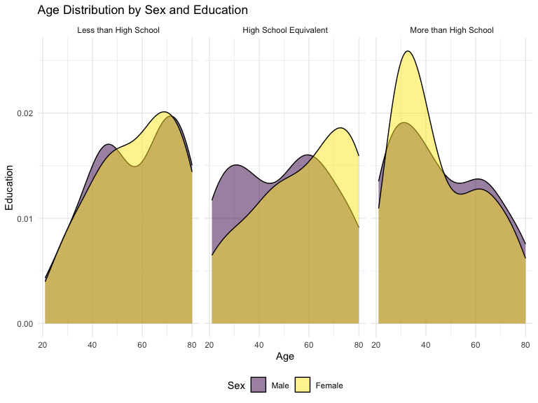
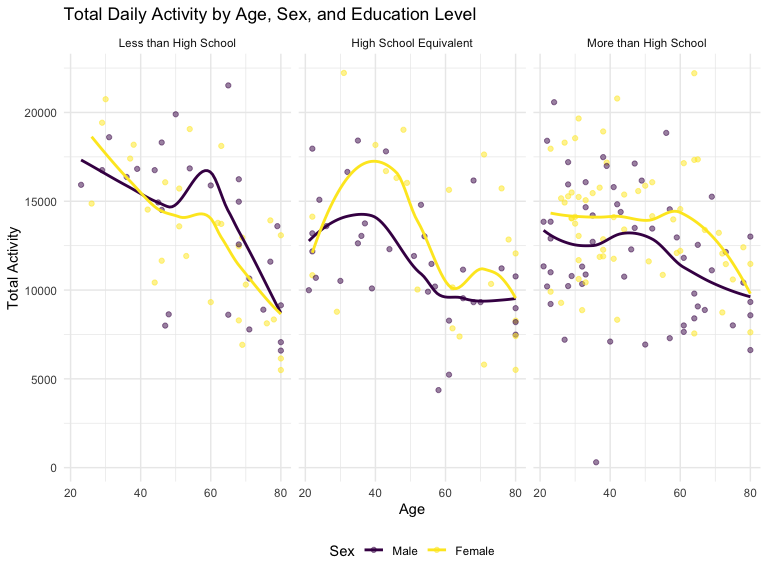
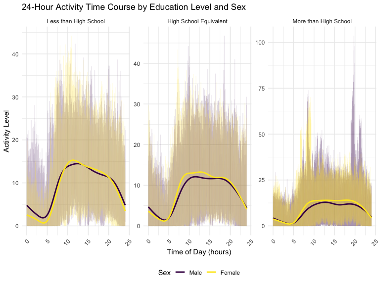
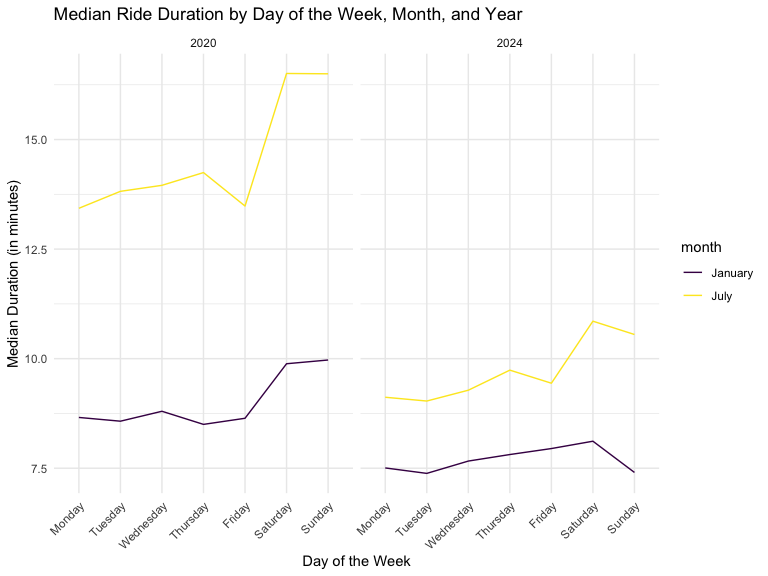
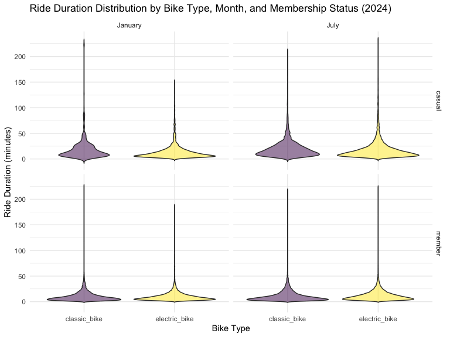

p8105_hw3_aw3621
================
Anni Wang
2024-10-14

``` r
library(tidyverse)
```

    ## ── Attaching core tidyverse packages ──────────────────────── tidyverse 2.0.0 ──
    ## ✔ dplyr     1.1.4     ✔ readr     2.1.5
    ## ✔ forcats   1.0.0     ✔ stringr   1.5.1
    ## ✔ ggplot2   3.5.1     ✔ tibble    3.2.1
    ## ✔ lubridate 1.9.3     ✔ tidyr     1.3.1
    ## ✔ purrr     1.0.2     
    ## ── Conflicts ────────────────────────────────────────── tidyverse_conflicts() ──
    ## ✖ dplyr::filter() masks stats::filter()
    ## ✖ dplyr::lag()    masks stats::lag()
    ## ℹ Use the conflicted package (<http://conflicted.r-lib.org/>) to force all conflicts to become errors

``` r
library(ggridges)
library(patchwork)

library(p8105.datasets)

knitr::opts_chunk$set(
    echo = TRUE,
    warning = FALSE,
    fig.width = 8, 
  fig.height = 6,
  out.width = "90%"
)

theme_set(theme_minimal() + theme(legend.position = "bottom"))

options(
  ggplot2.continuous.colour = "viridis",
  ggplot2.continuous.fill = "viridis"
)

scale_colour_discrete = scale_colour_viridis_d
scale_fill_discrete = scale_fill_viridis_d
```

``` r
data("ny_noaa")
```

#### Answer questions about the data

This dataset contains 2595176 rows and 7 columns. Variables include
weather station id, date of observation, (tenths of mm), snowfall (mm),
snow depth (mm), and min and max temperature (tenths of degrees C).

Below we clean the data, creating separate variables for year, month,
and day and converting `tmax` and `tmin` to numeric. We find that 0 is
the most commonly observed value for snowfall. This is because most days
of the year, it does not snow at all in NY. The second most commonly
observed value is `NA`, indicating missingness. Other common values are
13, 25, and 51, suggesting that snowfall is originally recorded in
fractions of an inch and converted to mm.

``` r
ny_noaa %>% 
  count(snow) %>%
  arrange(desc(n))
```

    ## # A tibble: 282 × 2
    ##     snow       n
    ##    <int>   <int>
    ##  1     0 2008508
    ##  2    NA  381221
    ##  3    25   31022
    ##  4    13   23095
    ##  5    51   18274
    ##  6    76   10173
    ##  7     8    9962
    ##  8     5    9748
    ##  9    38    9197
    ## 10     3    8790
    ## # ℹ 272 more rows

``` r
ny_noaa = 
  ny_noaa %>% 
  separate(date, into = c("year", "month", "day"), convert = TRUE) %>% 
  mutate(
    tmax = as.numeric(tmax),
    tmin = as.numeric(tmin))
```

Below is a two-panel plot showing the average max temperature in January
and in July in each station across years. As expected, the mean
temperature in January is much lower than the mean temperature in July
for all stations and across all years. All stations appear to follow
similar trends of temperature peaks and valleys within a month across
the years, i.e. when one station has a high monthly mean temperature for
a given year, most other stations also have a high monthly mean
temperature for that year. We do see one uncharacteristically cold
station in July of 1987 or 1988, as well as a few other less drastic
outliers.

``` r
ny_noaa %>% 
  group_by(id, year, month) %>% 
  filter(month %in% c(1, 7)) %>% 
  summarize(mean_tmax = mean(tmax, na.rm = TRUE, color = id)) %>% 
  ggplot(aes(x = year, y = mean_tmax, group = id)) + geom_point() + geom_path() +
  facet_grid(~month) +
  labs(title = "Mean monthly temperature for each station across years for January and July")
```

    ## `summarise()` has grouped output by 'id', 'year'. You can override using the
    ## `.groups` argument.


Below we show a two-panel plot including (i) a hex plot of `tmax` vs
`tmin` for the full dataset; and (ii) a ridge plot showing the
distribution of snowfall values (in mm) greater than 0 and less than 100
separately by year.

From the hex plot we see that while there is some variability, the
majority of the data cluster tightly in the center of the distribution.
In relatively rare cases, it seems that `tmax` is less than `tmin`,
which raises questions about data recording and quality.

From the ridge plot, we see a multimodal density of snowfall within a
given year. Most stations see between 0 and 35 mm of snow in a year.
Then there is a another group of stations that see about 45 mm of snow,
and another group that sees nearly 80 mm. It is likely this
multimodality stems from the conversion of measurements in one system
(fractions of an inch) to another (using the metric system), which was
also noted in the table of common values.

``` r
hex = 
  ny_noaa %>% 
  ggplot(aes(x = tmin, y = tmax)) + 
  geom_hex()

ridge = 
  ny_noaa %>% 
  filter(snow < 100, snow > 0) %>%
  ggplot(aes(x = snow, y = as.factor(year))) + 
  geom_density_ridges()

hex + ridge
```

    ## Picking joint bandwidth of 3.76


### Promblem 2

``` r
#load and tidy two datasets#

covardata_df =  
   read_csv("~/data/p8105_hw3_aw3621/data/nhanes_covar.csv", 
             na = c("NA",".",""),
             skip = 4
            ) |> 
   janitor::clean_names() |> 
   filter(age >= 21) |> 
   mutate(
    sex = factor(sex, levels = c(1, 2), 
           labels = c("Male", "Female")),
    education = factor(education, levels = c(1, 2, 3), 
           labels = c("Less than High School", "High School Equivalent", "More than High School"))
  ) |> 
drop_na()
```

    ## Rows: 250 Columns: 5
    ## ── Column specification ────────────────────────────────────────────────────────
    ## Delimiter: ","
    ## dbl (5): SEQN, sex, age, BMI, education
    ## 
    ## ℹ Use `spec()` to retrieve the full column specification for this data.
    ## ℹ Specify the column types or set `show_col_types = FALSE` to quiet this message.

``` r
 acceldata_df =  
   read_csv("~/data/p8105_hw3_aw3621/data/nhanes_accel.csv", 
             na = c("NA",".","")) |> 
   janitor::clean_names()
```

    ## Rows: 250 Columns: 1441
    ## ── Column specification ────────────────────────────────────────────────────────
    ## Delimiter: ","
    ## dbl (1441): SEQN, min1, min2, min3, min4, min5, min6, min7, min8, min9, min1...
    ## 
    ## ℹ Use `spec()` to retrieve the full column specification for this data.
    ## ℹ Specify the column types or set `show_col_types = FALSE` to quiet this message.

``` r
#combine 2 datasets together#
combined_data <- left_join(covardata_df,  acceldata_df, by = "seqn")
```

``` r
# Produce a reader-friendly table for the number of men and women in each education category
tableedu <- combined_data %>% 
  group_by(sex, education) %>% 
  summarise(count = n(), .groups = 'drop') %>% 
  pivot_wider(
    names_from = sex,
    values_from = count
  ) %>% 
  knitr::kable()

print(tableedu)
```

    ## 
    ## 
    ## |education              | Male| Female|
    ## |:----------------------|----:|------:|
    ## |Less than High School  |   27|     28|
    ## |High School Equivalent |   35|     23|
    ## |More than High School  |   56|     59|

``` r
#create a visualization of the age distributions for men and women in each education category
age_distribution_plot <- combined_data %>%
  ggplot(aes(x = age, fill = sex)) +
  geom_density(alpha = 0.5) + 
  facet_wrap(~education) +  
  labs(
    title = "Age Distribution by Sex and Education",
    x = "Age",
    y = "Education",
    fill = "Sex"
  ) 
print(age_distribution_plot)
```



\#Comment on these items - For Less than High School: The age
distribution fall under a wide range, peaking in middle age for both men
and women. - For High School Equivalent: There is a distinct peak in
middle age for males and a broader distribution for females. This
difference indicates varied access to education between genders during
this educational period. - For More than High School: Younger ages
(around 30s) take the majority for this category for both sexes,
indicating a clear shift towards higher educational attainment in recent
generations. Overall, we may see a clear difference between the age
distributions of males (purple) and females (yellow) by directly looking
at the graph color.

``` r
#aggregate across minutes to create a total activity variable for each participant
total_activity_df <- combined_data %>%
  mutate(total_activity = rowSums(select(., starts_with("min")), na.rm = TRUE))
head(total_activity_df)
```

    ## # A tibble: 6 × 1,446
    ##    seqn sex      age   bmi education  min1  min2  min3  min4   min5   min6  min7
    ##   <dbl> <fct>  <dbl> <dbl> <fct>     <dbl> <dbl> <dbl> <dbl>  <dbl>  <dbl> <dbl>
    ## 1 62161 Male      22  23.3 High Sch… 1.11  3.12  1.47  0.938 1.60   0.145  2.10 
    ## 2 62164 Female    44  23.2 More tha… 1.92  1.67  2.38  0.935 2.59   5.22   2.39 
    ## 3 62169 Male      21  20.1 High Sch… 5.85  5.18  4.76  6.48  6.85   7.24   6.12 
    ## 4 62174 Male      80  33.9 More tha… 5.42  3.48  3.72  3.81  6.85   4.45   0.561
    ## 5 62177 Male      51  20.1 High Sch… 6.14  8.06  9.99  6.60  4.57   2.78   7.10 
    ## 6 62178 Male      80  28.5 High Sch… 0.167 0.429 0.131 1.20  0.0796 0.0487 0.106
    ## # ℹ 1,434 more variables: min8 <dbl>, min9 <dbl>, min10 <dbl>, min11 <dbl>,
    ## #   min12 <dbl>, min13 <dbl>, min14 <dbl>, min15 <dbl>, min16 <dbl>,
    ## #   min17 <dbl>, min18 <dbl>, min19 <dbl>, min20 <dbl>, min21 <dbl>,
    ## #   min22 <dbl>, min23 <dbl>, min24 <dbl>, min25 <dbl>, min26 <dbl>,
    ## #   min27 <dbl>, min28 <dbl>, min29 <dbl>, min30 <dbl>, min31 <dbl>,
    ## #   min32 <dbl>, min33 <dbl>, min34 <dbl>, min35 <dbl>, min36 <dbl>,
    ## #   min37 <dbl>, min38 <dbl>, min39 <dbl>, min40 <dbl>, min41 <dbl>, …

``` r
#Plot these total activities (y-axis) against age (x-axis)
activity_plot =
   total_activity_df |> 
   ggplot(aes(x = age, y = total_activity, color = sex)) +
   geom_point(alpha = 0.5) +  
   geom_smooth(se = FALSE) + 
   facet_wrap(~ education) + 
   labs(
     title = "Total Daily Activity by Age, Sex, and Education Level",
     x = "Age",
     y = "Total Activity",
     color = "Sex") +
  theme_minimal() + 
  theme(legend.position = "bottom")

print(activity_plot)
```

    ## `geom_smooth()` using method = 'loess' and formula = 'y ~ x'



\#Comment on plot The plot illustrates total daily activity across
different education levels, showing that activity generally peaks around
middle age (40-60 years) for both males and females in the “Less than
High School” and “High School Equivalent” categories, before declining
in older age. In contrast, the “More than High School” category exhibits
more variability in activity levels, with a less distinct peak. Males
consistently show higher peaks of activity compared to females,
especially in the “High School Equivalent” category, and also display a
broader range of total activity across most categories.

``` r
#Make a three-panel plot that shows the 24-hour activity time courses for each education level and use color to indicate sex

three_panel_plot <- combined_data %>%
  pivot_longer(
    cols = starts_with("min"),      
    names_to = "minute",            
    names_prefix = "min",           
    values_to = "activity_level"   
  ) %>%
  mutate(
    hour = as.numeric(minute) / 60  
  ) %>%
  group_by(minute, sex, education)

three_panel_plotnew <- three_panel_plot %>%
  ggplot(aes(x = hour, y = activity_level, color = sex)) +
  geom_line(alpha = 0.1) +          
  geom_smooth(se = FALSE) +           
  facet_wrap(~education, scales = "free_y") +  
  labs(
    title = "24-Hour Activity Time Course by Education Level and Sex",
    x = "Time of Day (hours)",
    y = "Activity Level",
    color = "Sex"
  ) +
  theme_minimal() +
  theme(legend.position = "bottom",   
        axis.text.x = element_text(angle = 45, hjust = 1))  

print(three_panel_plotnew)
```

    ## `geom_smooth()` using method = 'gam' and formula = 'y ~ s(x, bs = "cs")'



\#conclusions made based on this graph This graph shows daily activity
patterns for people based on their education level and gender/sex.
People with less than high school education are most active in the
morning and less so in the evening. Those with a high school diploma
stay active longer, into the afternoon. Individuals with more than high
school education show unpredictable activity times, with peaks even late
at night, suggesting they might have flexible or unusual work hours. Men
generally show slightly higher activity levels than women. Smooth trend
lines we created in the graph help highlight these differences more
clearly, making it easier to see how activity levels change throughout
the day for different groups.

\###Problem 3

``` r
library(readr)
library(janitor)
```

    ## 
    ## Attaching package: 'janitor'

    ## The following objects are masked from 'package:stats':
    ## 
    ##     chisq.test, fisher.test

``` r
jan2020_df <- read_csv("~/data/p8105_hw3_aw3621/data/Jan 2020 Citi.csv") %>%
  clean_names()
```

    ## Rows: 12420 Columns: 7

    ## ── Column specification ────────────────────────────────────────────────────────
    ## Delimiter: ","
    ## chr (6): ride_id, rideable_type, weekdays, start_station_name, end_station_n...
    ## dbl (1): duration
    ## 
    ## ℹ Use `spec()` to retrieve the full column specification for this data.
    ## ℹ Specify the column types or set `show_col_types = FALSE` to quiet this message.

``` r
jan2024_df <- read_csv("~/data/p8105_hw3_aw3621/data/Jan 2024 Citi.csv") %>%
  clean_names()
```

    ## Rows: 18861 Columns: 7
    ## ── Column specification ────────────────────────────────────────────────────────
    ## Delimiter: ","
    ## chr (6): ride_id, rideable_type, weekdays, start_station_name, end_station_n...
    ## dbl (1): duration
    ## 
    ## ℹ Use `spec()` to retrieve the full column specification for this data.
    ## ℹ Specify the column types or set `show_col_types = FALSE` to quiet this message.

``` r
july2020_df <- read_csv("~/data/p8105_hw3_aw3621/data/July 2020 Citi.csv") %>%
  clean_names()
```

    ## Rows: 21048 Columns: 7
    ## ── Column specification ────────────────────────────────────────────────────────
    ## Delimiter: ","
    ## chr (6): ride_id, rideable_type, weekdays, start_station_name, end_station_n...
    ## dbl (1): duration
    ## 
    ## ℹ Use `spec()` to retrieve the full column specification for this data.
    ## ℹ Specify the column types or set `show_col_types = FALSE` to quiet this message.

``` r
july2024_df <- read_csv("~/data/p8105_hw3_aw3621/data/July 2024 Citi.csv") %>%
  clean_names()
```

    ## Rows: 47156 Columns: 7
    ## ── Column specification ────────────────────────────────────────────────────────
    ## Delimiter: ","
    ## chr (6): ride_id, rideable_type, weekdays, start_station_name, end_station_n...
    ## dbl (1): duration
    ## 
    ## ℹ Use `spec()` to retrieve the full column specification for this data.
    ## ℹ Specify the column types or set `show_col_types = FALSE` to quiet this message.

``` r
total_df <- bind_rows(
  jan2020_df %>% mutate(month = "January", year = 2020),
  jan2024_df %>% mutate(month = "January", year = 2024),
  july2020_df %>% mutate(month = "July", year = 2020),
  july2024_df %>% mutate(month = "July", year = 2024)
)
```

\#there are 99485 observations and 9 variables in the file I combine 4
files in zip file together after I clean those 4 and combine them

``` r
#Produce a reader-friendly table showing the total number of rides in each combination of year and month separating casual riders and Citi Bike members
 q3 =
   total_df |> 
   group_by(year, month, member_casual) |> 
   summarise(total_rides = n()) |> 
   pivot_wider(names_from = member_casual, values_from = total_rides) |>
   knitr::kable()
```

    ## `summarise()` has grouped output by 'year', 'month'. You can override using the
    ## `.groups` argument.

``` r
print(q3)
```

    ## 
    ## 
    ## | year|month   | casual| member|
    ## |----:|:-------|------:|------:|
    ## | 2020|January |    984|  11436|
    ## | 2020|July    |   5637|  15411|
    ## | 2024|January |   2108|  16753|
    ## | 2024|July    |  10894|  36262|

\#Comment on these results The table indicates that Citi Bike usage has
grown significantly from 2020 to 2024, with both members and casual
riders showing increased activity, particularly in July compared to
January, reflecting seasonal preferences for biking. Membership rides
consistently outnumber casual rides. The increase in rides, especially
among casual users over the years, suggests a potential opportunities
for converting more casual riders into members.

``` r
#Make a table showing the 5 most popular starting stations for July 2024
 popular5_july20224 =
   july2024_df |> 
   group_by(start_station_name) |> 
   summarise(total_rides = n(), .groups = "drop") |> 
   arrange(desc(total_rides)) |> 
   slice_head(n = 5) |> 
   knitr::kable()

 print(popular5_july20224)
```

    ## 
    ## 
    ## |start_station_name       | total_rides|
    ## |:------------------------|-----------:|
    ## |Pier 61 at Chelsea Piers |         163|
    ## |University Pl & E 14 St  |         155|
    ## |W 21 St & 6 Ave          |         152|
    ## |West St & Chambers St    |         150|
    ## |W 31 St & 7 Ave          |         146|

``` r
#Make a plot to investigate the effects of day of the week, month, and year on median ride duration
median_duration_df <- total_df %>%
  mutate(weekdays = factor(weekdays, levels = c("Monday", "Tuesday", "Wednesday", "Thursday", "Friday", "Saturday", "Sunday"))) %>%
   group_by(year, month, weekdays) %>%
  summarize(median_duration = median(duration), .groups = "drop")

duration_plot <- ggplot(median_duration_df, aes(x = weekdays, y = median_duration, group = interaction(month, year), color = month)) +
  geom_line() +
  facet_grid(. ~ year) +
  labs(
    title = "Median Ride Duration by Day of the Week, Month, and Year",
    x = "Day of the Week",
    y = "Median Duration (in minutes)"
  ) +
  theme_minimal() +
  theme(axis.text.x = element_text(angle = 45, hjust = 1))

print(duration_plot)
```



\#Comment The graph illustrates median ride durations for Citi Bike
users across different days of the week during January and July of 2020
and 2024. It highlights that rides are generally longer in July than in
January (may due to weather). Ride durations peak on weekends and
there’s a rise in ride durations on Thursdays and Fridays in July 2024.
These trends are consistent across both years, 2024 has a shorter median
ride duration overall than 2020 in both January and July.

``` r
#make a figure that shows the impact of month, membership status, and bike type on the distribution of ride duration

 q3_df = 
   total_df|> 
   filter(year == 2024)

 q3_df |> 
   ggplot(aes(x = rideable_type, y = duration, fill = rideable_type)) +
   geom_violin(trim = FALSE, alpha = 0.5) +
   facet_grid(member_casual ~ month) +
   labs(
        title = "Ride Duration Distribution by Bike Type, Month, and Membership Status (2024)",
         x = "Bike Type",
         y = "Ride Duration (minutes)",
         fill = "Bike Type"
  ) +
  theme_minimal() +
  theme(legend.position = "none")
```



\#Comment The graph illustrates ride duration distributions for Citi
Bike users in 2024, highlighting differences across bike types, months,
and membership statuses. Electric bikes show longer ride durations
compared to classic bikes, suggesting a preference for longer or more
comfortable rides with electric assistance. Classic bikes shows wider
distribution of ride duration, especially among casual riders,
indicating the variability in how they are used. Members tend to have
shorter rides than casual users and narrower distribution, which could
indicate that members use bikes more for practical, routine commutes
while casual riders might rent bikes for leisure or touring purposes
